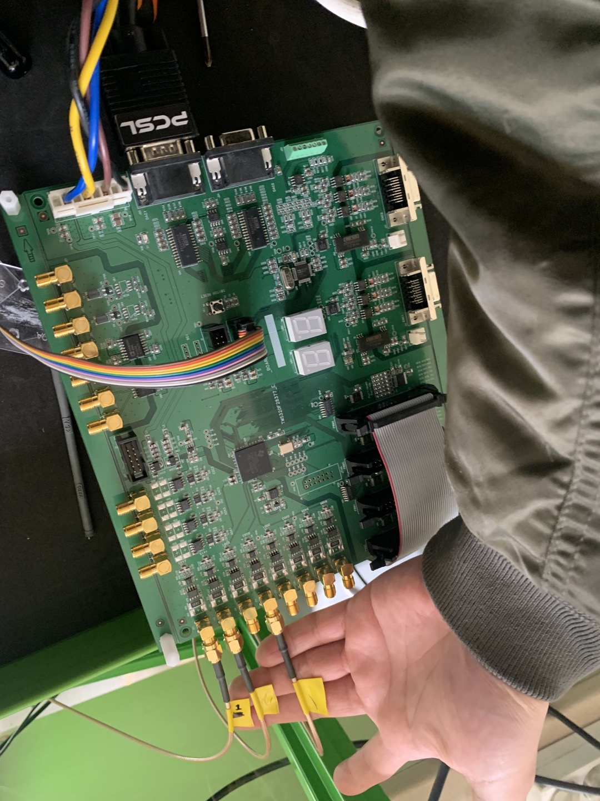
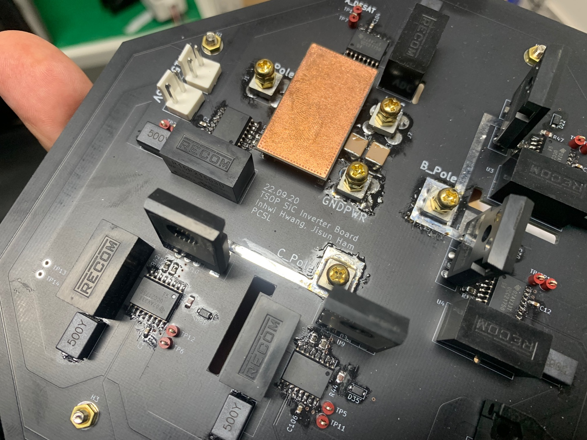
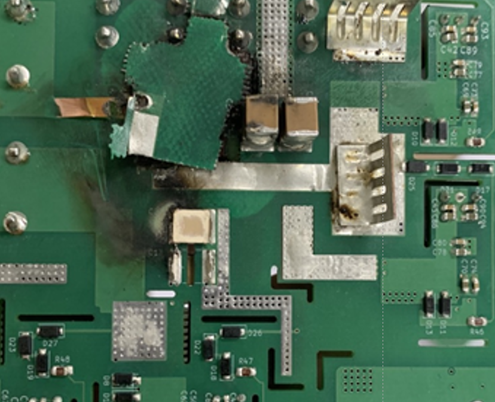

# Hardware designs

### Hardware skill is the most valuable and challenging for power electronics engineer.

#### Hardware 1: 3.2 kW Single-phase totempole SiC PFC

made by Inhwi Hwang. Max efficiency: 99.09 %

#### Hardware 2: 3.2 kW Single-phase totempole GaN PFC

made by Inhwi Hwang. Max efficiency: 98.97 %

#### Hardware 3: Intergrated digital control board (4 channel PWM, ADC, DAC, encoder, SCI communication) with Ti TMS32028377D.

Made by Inhwi Hwang, next version will equip the ethercat od Ti TMS32028388D

This is used for following tasks

1. SiC temperature estimation with electroluminescence effect
2. High frequency signal injection sensorless control of IPMSM
3. PFC
4. PFC + motor drive

#### Hardware 4: SiC three-phase PFC circuit for real-time temperature estimation with electroluminescence effect of SiC body diode

Made by Inhwi Hwang (additional photo-sensing circuit is made by Jisun Ham)

####Hardware 5: Explosion on my board!

High frequency ceramic snubber capacitor could not endure high frequency current ripples. I should have scrutinized the datasheet...!

There were lots of explosions on my board, but all hardships were for perfection!

Failures always give me great lessons.

