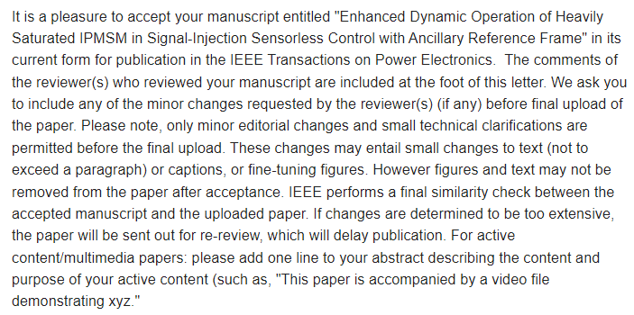

(Recently updated on 22.12.26.)

 [TPEL_1st_Author_2022.pdf](..\materials\pub_1.pdf)

 [TPEL_Co_Author_2022.pdf](..\materials\pub_2.pdf)

 [ECCE_1st_Author_2022.pdf](..\materials\pub_3.pdf)

 [ECCE_Asia_Corresponding_Author_2023.pdf](..\materials\pub_4.pdf)

 [ECCE_Co_Author_2021.pdf](..\materials\pub_5.pdf)

 [Graduation_Project_Poster.pdf](..\materials\poster.pdf)

5 papers and 1 B.S. project poster.

[Link] (https://ieeexplore.ieee.org/document/9999537)

(*My 1st author TPEL paper is early-accessed)

I have more ideas for next publications, so, after my admission process completed, I will be dedicated on researching, studying and writing!
