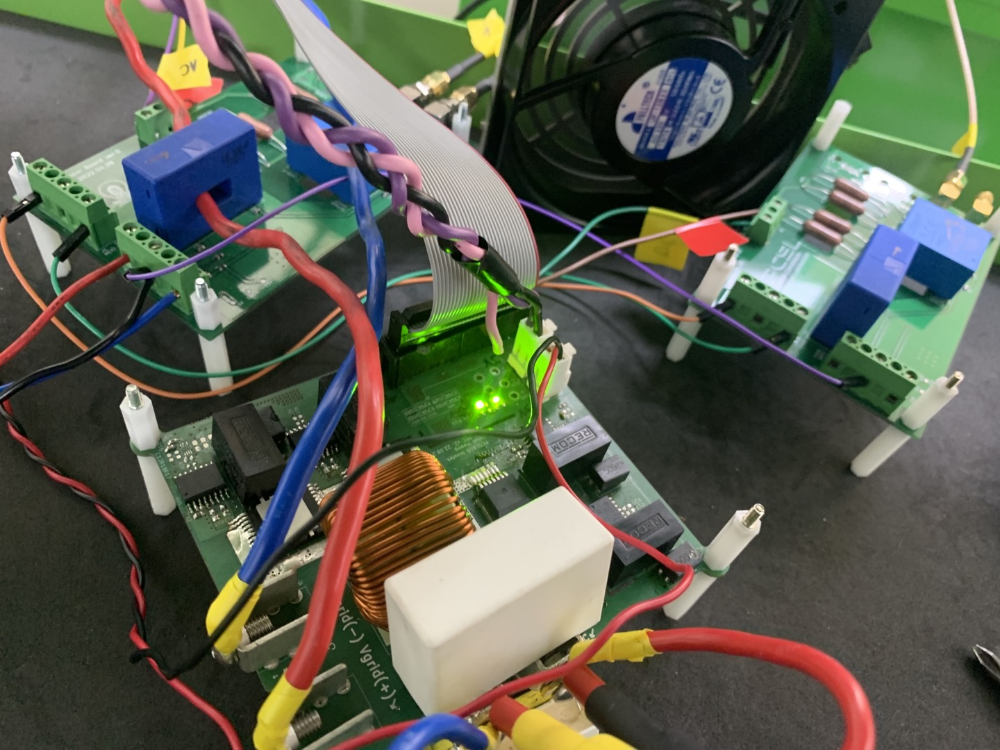
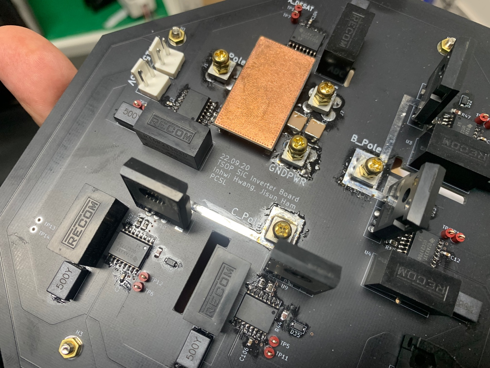

(Recently updated on 23.01.19.)

### Hardware skill is the most valuable and challenging for power electronics engineer. My dream is having my own laboratory in my house and designing various type of hardwares there.

### Following pictures show you some of my hardware circuits!

#### Hardware 1: 3.2 kW Single-phase totempole SiC PFC

made by Inhwi Hwang. Max efficiency: 99.09 %

#### Hardware 2: 3.2 kW Single-phase totempole GaN PFC

made by Inhwi Hwang. Max efficiency: 98.97 %

#### Hardware 3: SiC three-phase PFC circuit for real-time temperature estimation with electroluminescence effect of SiC body diode

Made by Inhwi Hwang (additional photo-sensing circuit is made by Jisun Ham)

#### Hardware 4: Servo IPMSM-SMPMSM (motor-generator) set with 3 phase 2 level inverter and control board (1 kW)

Made by Inhwi Hwang

#### Hardware 5: Failure!

High frequency ceramic snubber capacitor could not endure high frequency current ripples. I should have scrutinized the datasheet...!

There were lots of explosions on my board, but all hardships were for perfection!

Failures always give me great lessons.

=======
>>>>>>> 

